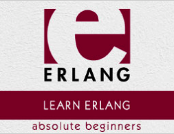

```
Roberto Nogueira  
BSd EE, MSd CE
Solution Integrator Experienced - Certified by Ericsson
```
# Tutorialspoint Erlang



**About This Tutorial**

This is to grasp rapidly the language and its concepts.

[Erlang Tutorial](https://www.tutorialspoint.com/erlang/index.htm)

#### Topics
```
Erlang Tutorial
[x] Home
[x] Overview
[x] Environment
[x] Basic Syntax
[x] Shell
[ ] Data Types
[ ] Variables
[ ] Operators
[ ] Loops
[ ] Decision Making
[ ] Functions
[ ] Modules
[ ] Recursion
[ ] Numbers
[ ] Strings
[ ] Lists
[ ] File I/O
[ ] Atoms
[ ] Maps
[ ] Tuples
[ ] Records
[ ] Exceptions
[ ] Macros
[ ] Header Files
[ ] Preprocessors
[ ] Pattern Matching
[ ] Guards
[ ] BIFS
[ ] Binaries
[ ] Funs
[ ] Processes
[ ] Emails
[ ] Databases
[ ] Ports
[ ] Distributed Programming
[ ] OTP
[ ] Concurrency
[ ] Performance
[ ] Drivers
[ ] Web Programming
Erlang Useful Resources
[ ] Quick Guide
[ ] Useful Resources
[ ] Discussion
Selected Reading
[ ] Developer's Best Practices
[ ] Questions and Answers
[ ] Effective Resume Writing
[ ] HR Interview Questions
[ ] Computer Glossary
[ ] Who is Who
```

